# Synexus Admin Dashboard

A responsive admin dashboard built with React.js as part of the Frontend Development Internship at Synexus Software Technologies.

## Features (Week 1)

- Responsive layout with a persistent, collapsible sidebar and top header
- Client-side routing across 4 pages: Overview, Inventory, Settings, Reports
- Sidebar automatically collapses on mobile/tablet screens, with a hamburger menu toggle
- Layout tested and confirmed working across desktop, tablet, and mobile breakpoints

## Features (Week 2)

- Complex "Add Employee" form with multiple input types: text, dropdown, radio buttons, date picker, and file upload
- Client-side validation for required fields, email format, and minimum length
- Friendly, field-specific error messages that clear once corrected
- Form prevents submission until all validation passes

## Features (Week 3)

- Live data fetched from a public REST API (JSONPlaceholder)
- Animated skeleton loader shown while data is loading
- Error and empty states handled gracefully
- Real-time search filtering by name
- Sortable columns (Name, Email, Company) with ascending/descending toggle
- Pagination with Previous/Next controls

## Features (Week 4)

- Reusable component library: `Button`, `Input`, `Card`, `SearchBar`, `Pagination`, `TableSkeleton`
- Components accept configuration through props (variant, size, disabled, loading, error, etc.)
- Components composed together (e.g. `Pagination` internally uses `Button`)
- Same components reused across multiple pages (Add Employee form and Inventory table)
- Synexus brand logo implemented in the sidebar, replacing plain text branding

## Tech Stack

- React.js
- React Router (react-router-dom)
- Vite
- CSS (Flexbox, media queries, CSS animations)

## Getting Started

### Prerequisites
- Node.js installed ([download here](https://nodejs.org))

### Installation

1. Clone the repository
git clone https://github.com/UroojSheikh/synexus-admin-dashboard.git

2. Navigate into the project folder
cd synexus-admin-dashboard

3. Install dependencies
npm install

4. Start the development server
npm run dev

5. Open your browser to `http://localhost:5173`

## Project Structure
src/
├── components/
│   ├── Button.jsx
│   ├── Input.jsx
│   ├── Card.jsx
│   ├── SearchBar.jsx
│   ├── Pagination.jsx
│   └── TableSkeleton.jsx
├── pages/
│   ├── Overview.jsx
│   ├── Inventory.jsx
│   ├── Settings.jsx
│   ├── Reports.jsx
│   └── AddEmployee.jsx
├── assets/
│   └── synexus-logo.png
├── App.jsx        # main layout + routing
├── App.css         # layout and responsive styling

## Component Notes

**App.jsx**
The main layout and routing controller for the app. Manages the sidebar's open/closed state using `useState`, and wraps the entire app in `BrowserRouter`. Renders the persistent sidebar (with the Synexus brand logo) and top header, while page content is swapped dynamically via React Router based on the current URL. Also handles closing the sidebar automatically on navigation, for mobile usability.

**App.css**
Handles all layout and responsive styling. Uses Flexbox to split the layout into a fixed-width sidebar and a flexible content area (`flex: 1`). Media queries (`max-width: 768px`) control the collapsible sidebar behavior on smaller screens. Also includes the shimmer animation used by `TableSkeleton`.

**pages/Overview.jsx, Settings.jsx, Reports.jsx**
Placeholder page components, as explicitly permitted by the project requirements ("set up routing for at least three placeholder pages"). Routed and accessible via the sidebar.

**pages/Inventory.jsx**
Fetches user data from a public API on mount using `useEffect` and `fetch`. Shows an animated `TableSkeleton` while loading, and handles error and empty states. Includes live search (via the reusable `SearchBar` component), sortable columns (toggling ascending/descending via clickable headers), and pagination (via the reusable `Pagination` component).

**pages/AddEmployee.jsx**
A complex form for adding a new employee, wrapped in a `Card` component. Demonstrates controlled inputs across every major HTML input type (text, select, radio, date, file), using the reusable `Input` component for text fields. Uses a single `errors` state object to track field-level validation, checked via a `validate()` function before allowing submission.

**components/Button.jsx**
Reusable button supporting `variant` (primary, secondary, danger), `size` (small, medium, large), `disabled`, and `loading` states. Used in the Add Employee form and internally within `Pagination`.

**components/Input.jsx**
Reusable form input bundling a label, controlled input, and conditional error message into one component. Used for the Name and Email fields in the Add Employee form.

**components/Card.jsx**
Reusable content wrapper with consistent padding, border, and background, with an optional title heading. Wraps the Add Employee form.

**components/SearchBar.jsx**
Reusable search input, currently used to filter the Inventory table by name.

**components/Pagination.jsx**
Reusable pagination controls (Previous/Next buttons + page indicator), built using the `Button` component internally. Used in the Inventory table.

**components/TableSkeleton.jsx**
Reusable animated loading placeholder for tables, configurable via `rows` and `columns` props. Displays a shimmering CSS animation while data is being fetched.

**Counter.jsx / ToggleText.jsx / Greeting.jsx**
Early learning components built while practicing React fundamentals (props, state, conditional rendering). Not part of the current dashboard UI, kept as a record of the learning process.

## Validation Scenarios (Week 2)

The Add Employee form validates the following cases:

| Field | Validation Rule | Error Message |
|---|---|---|
| Full Name | Minimum 2 characters | "Name must be at least 2 characters." |
| Email | Must contain "@" and "." | "Please enter a valid email address." |
| Department | Must be selected | "Please select a department." |
| Employment Type | Must be selected | "Please select an employment type." |
| Start Date | Must be selected | "Please select a start date." |

Profile Photo is optional and has no validation. All other fields are required; the form will not submit until every validation rule passes.

## API Notes (Week 3)

The Inventory page fetches data from a public REST API used for testing/prototyping:

- **Endpoint:** `https://jsonplaceholder.typicode.com/users`
- **Method:** GET
- **Response:** Array of user objects (id, name, email, company, etc.)
- No authentication required
- Data is fetched once on component mount using `useEffect`

## Screenshots

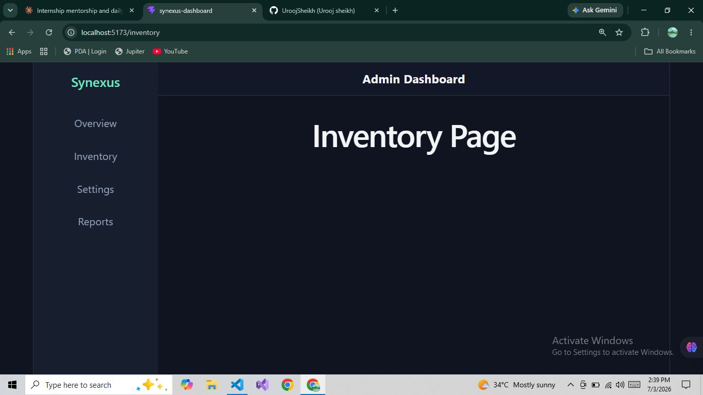
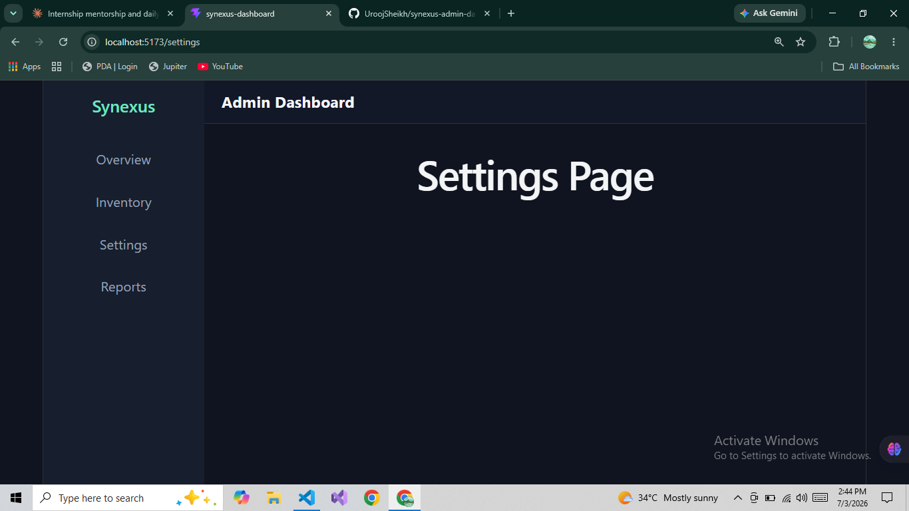
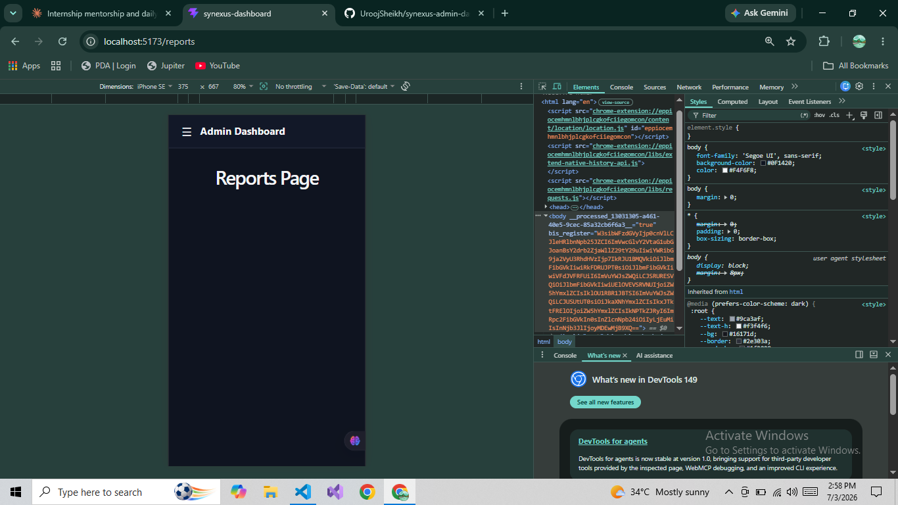
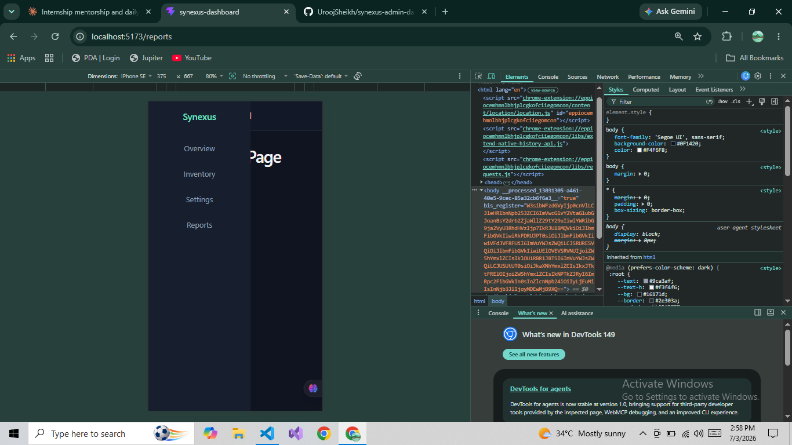
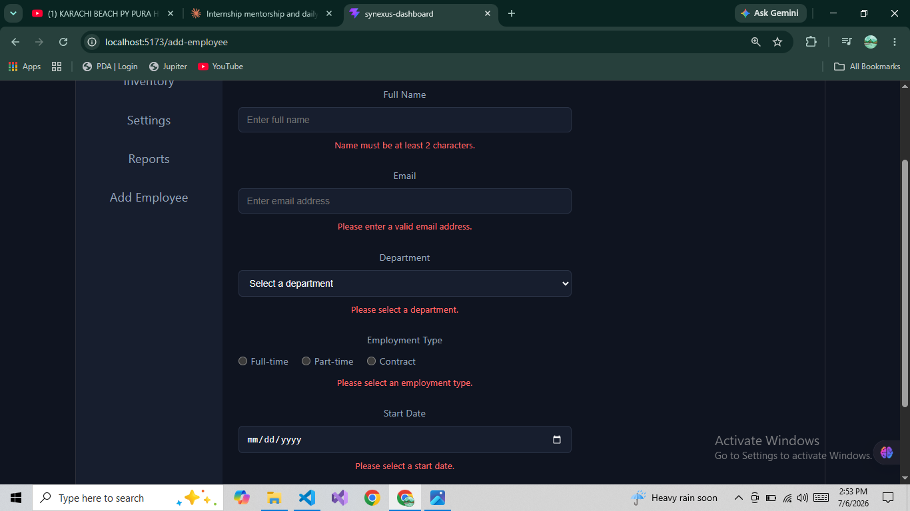
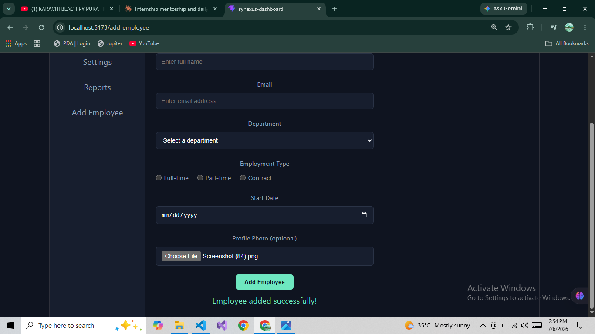
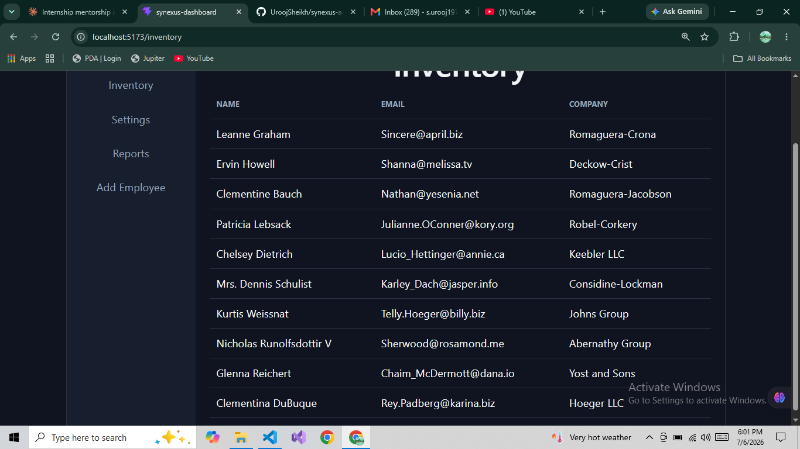
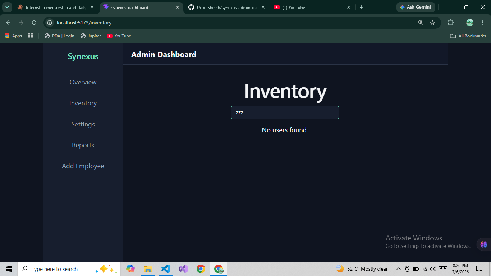
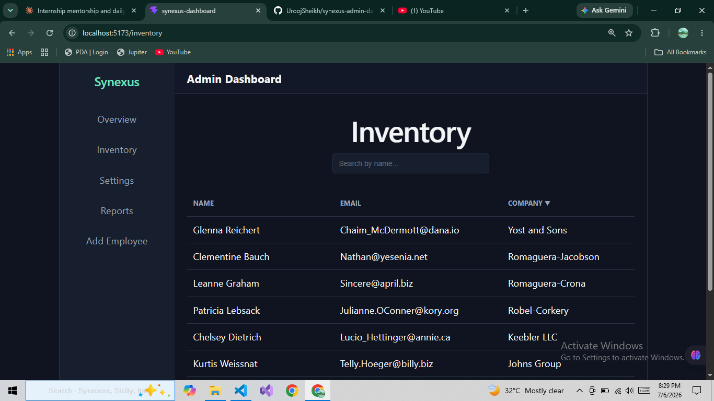
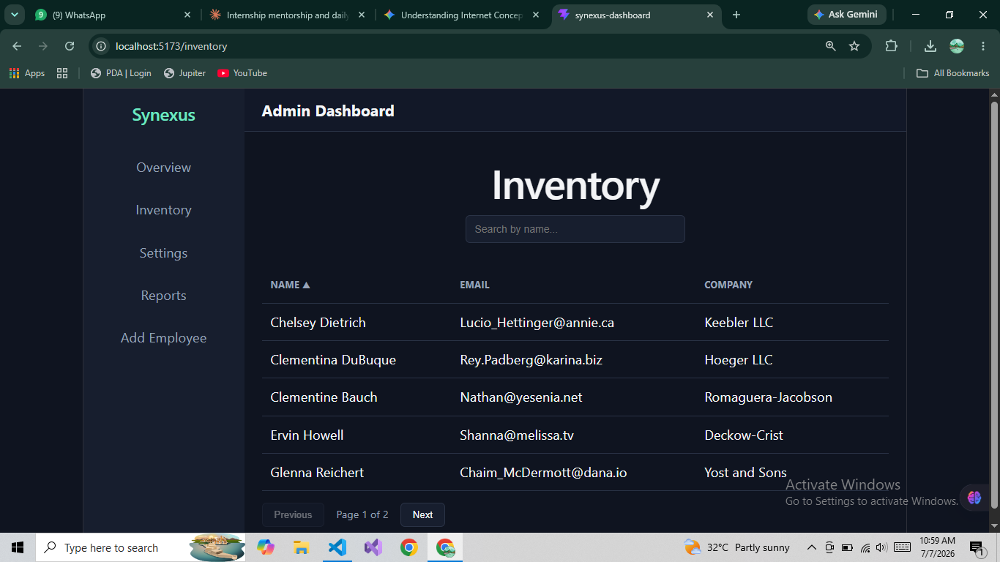
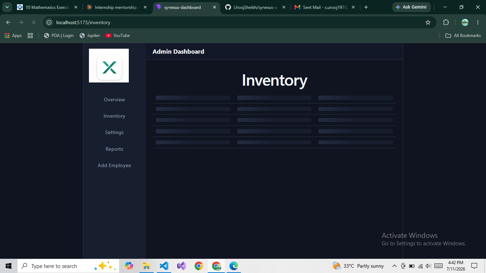
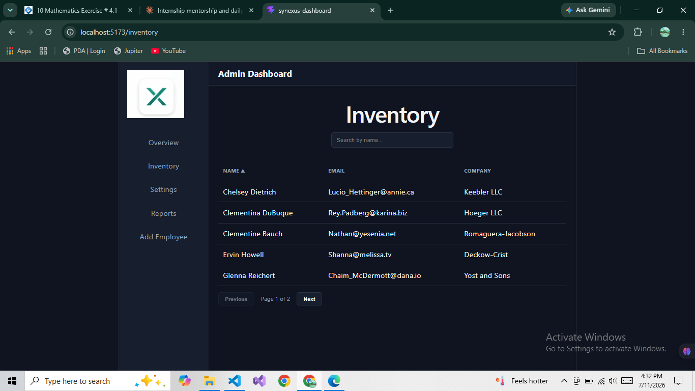

## Known Limitations / Next Steps

- Overview, Settings, and Reports pages are placeholders, as explicitly permitted by the project brief
- Sidebar navigation currently uses plain `<Link>` — active route highlighting could be added in a future iteration
- Inventory data is from a placeholder API; would connect to real backend data in a production setting
- Add Employee form currently logs submissions to the console; would connect to a real/mock API endpoint in a production setting

## Author

Urooj Sheikh — [LinkedIn](https://www.linkedin.com/in/urooj-sheikh/)